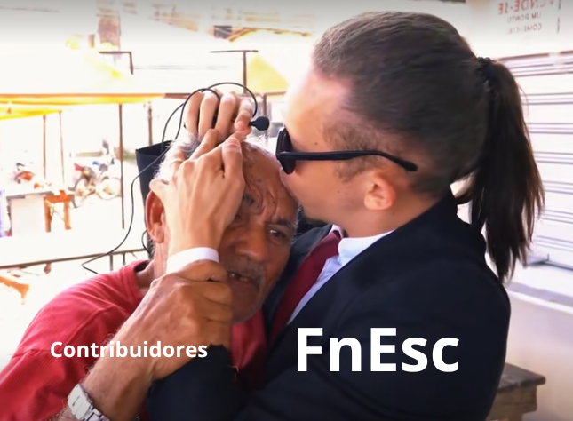

<p align="center">
  
</p>

## CONTRIBUA COM O PROJETO!

Quando tive a ideia de utilizar um joystick no lugar dos botões, tinha dois objetivos em mente: facilitar a implementação de novas direções e movimentos, como diagonais principais e secundárias, movimentos circulares, semicírculos etc., além de trazer ao brinquedo uma estética inspirada nos anos 90. Essa estética, inclusive, era um dos meus principais objetivos desde o princípio.

Não sei quando essa ideia será implementada no Arc ace, mas espero que não seja por mim *bjs*. Dito isso, obrigado por colaborar com o Arc ace!

## Como contribuir

Você pode contribuir de várias formas:

* Melhorando o código do projeto
* Corrigindo bugs
* Melhorando a documentação
* Sugerindo melhorias no software
* Propondo novas funcionalidades com issues

Mesmo que você não entenda nada do código, é importante também receber recomendações e críticas (construtivas).

## Processo de contribuição

1. Faça um **fork** deste repositório.
2. Crie uma nova **branch** para sua alteração.

Exemplo:

```bash
git checkout -b minha-melhoria
```

> Observação: Isso foi um **EXEMPLO**! Deixa a branch com um nome autoexplicativo, por favor. Se aparecer uma branch com o nome "minha melhoria", eu vou rir e **negar**.

3. Faça suas modificações no código.
4. Realize commits claros e descritivos. Se possível, use as palavras chaves "feat, chore, refact, fix" e entre outros.

Exemplo:

```bash
git commit -m "feat: adiciona novos movimentos"
```

5. Envie um **Pull Request** explicando EXATAMENTE o que foi alterado.

Se tudo ocorrer bem e aceitarmos a sua contribuição, seu perfil irá ser listado na seção "contribuidores".

> Nota: Há também a oportunidade de você ganhar um *chêro* meu.  

## Hardware

Antes de propor mudanças no código, verifique se elas são compatíveis
com os componentes listados no README do projeto.

## Boas práticas

Ao contribuir com o projeto, procure:

* manter o código organizado
* comentar partes importantes do código
* manter compatibilidade com o hardware utilizado no projeto
* evitar mudanças que comprometam a estabilidade do sistema
* não remover comentários importantes

## Sugestões e problemas

Caso encontre algum problema ou tenha uma sugestão de melhoria, abra uma **Issue** descrevendo:

* o problema encontrado
* como reproduzir o erro
* possíveis soluções (se houver)

## Orientação para desenvolvedores da FnEsc

Caso alguma modificação seja realizada no **Arc ace**, procure documentar as alterações neste repositório para facilitar o trabalho dos próximos desenvolvedores.

Mantenha sempre o repositório atualizado e compatível com o estado atual do projeto.

Toda contribuição que ajude a melhorar o projeto é bem-vinda!

<p align="center">
  
</p>
