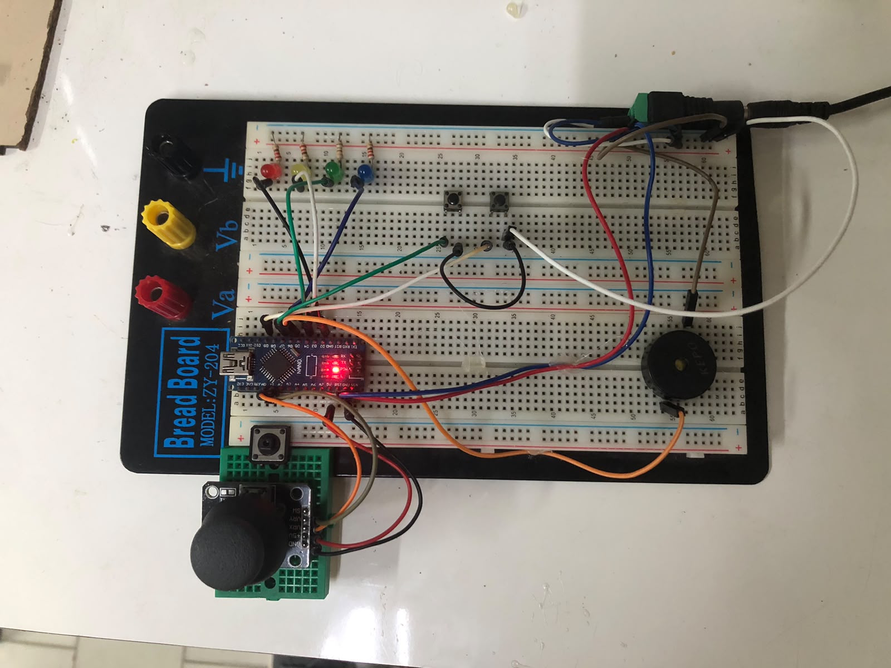
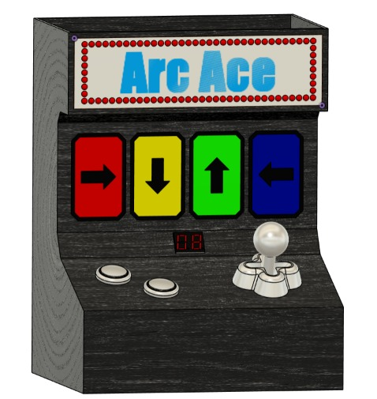

# Arc ace

Um jogo de memória eletrônico desenvolvido com **Arduino Nano** e joystick** no laboratório **Física na Escola (FnE)**, do Departamento de Física da Universidade Federal de Sergipe (UFS).

O jogador deve memorizar e reproduzir uma sequência de quatro direções indicada pelos LEDs e pelo buzzer. A cada rodada, uma nova direção é adicionada à sequência, aumentando progressivamente a dificuldade.



## Funcionamento

O jogo possui quatro direções possíveis:

| Direção  | LED      | Frequência |
| -------- | -------- | ---------: |
| Direita  | Azul     |     262 Hz |
| Esquerda | Vermelho |     294 Hz |
| Baixo    | Verde    |     330 Hz |
| Cima     | Amarelo  |     349 Hz |

A sequência é gerada aleatoriamente pelo Arduino.

Em cada rodada:

1. O sistema adiciona uma nova direção à sequência.
2. Os LEDs e o buzzer apresentam a sequência ao jogador.
3. O jogador reproduz a sequência utilizando o joystick.
4. Cada movimento recebe feedback visual e sonoro.
5. Se o jogador acertar, o contador da Apple Juice é incrementado.
6. Se o jogador errar, a partida termina e o contador é reiniciado.

O jogo suporta sequências de até **32 posições**.

## Controles

### Joystick

O joystick é responsável por detectar as quatro direções:

* **Direita**
* **Esquerda**
* **Baixo**
* **Cima**

Uma zona morta é utilizada para evitar que pequenas variações do joystick sejam interpretadas como movimentos.

Depois que uma direção é detectada, o sistema aguarda o retorno do joystick à posição central antes de aceitar o próximo movimento.

### Botões

O projeto possui dois botões:

* **PLAY** — inicia uma partida.
* **STOP** — encerra a partida atual.

O sinal de **RESET** é utilizado para reiniciar o contador da Apple Juice.

## LEDs e buzzer

Cada direção possui um LED correspondente.

Quando uma direção da sequência é apresentada:

1. O LED correspondente acende.
2. O buzzer reproduz o tom associado.
3. O LED é apagado e o buzzer é desligado.

O mesmo sistema de feedback é utilizado quando o jogador realiza uma jogada.

## Apple Juice

A **Apple Juice** é uma placa desenvolvida por Francisco Passos para a FnE para auxiliar na utilização dos pinos do Arduino em projetos educacionais.

Neste projeto, ela é utilizada para controlar o contador de pontuação através de dois sinais:

* **CLOCK** — incrementa o contador.
* **RESET** — reinicia o contador.

A comunicação utiliza dois pinos digitais do Arduino:

```cpp
const int applejuice_clock = 10;
const int applejuice_reset = 11;
```

Mais informações sobre a Apple Juice e seu simulador:

[Apple Juice - github](https://github.com/FrankSteps/apple-juice-learning-board-simulator?utm_source=chatgpt.com)

## Hardware

O projeto utiliza:

* Arduino Nano
* Placa Apple Juice
* Joystick analógico
* 4 LEDs
* Resistores para os LEDs
* Buzzer passivo
* 2 botões
* Case desenvolvido em modelagem 3D
* Componentes necessários para as conexões elétricas

### Modelo 3D

O case do ArcAce foi idealizado por Francisco e modelado e melhorado por Scarnera especificamente para este projeto.



## Ligações

| Componente        | Pino do Arduino |
| ----------------- | --------------: |
| LED vermelho      |              D2 |
| LED amarelo       |              D3 |
| LED verde         |              D4 |
| LED azul          |              D5 |
| Buzzer            |              D6 |
| PLAY              |              D7 |
| STOP              |              D9 |
| Apple Juice CLOCK |             D10 |
| Apple Juice RESET |             D11 |
| Joystick X        |              A0 |
| Joystick Y        |              A1 |

O pino **A3** é utilizado como fonte para a geração da semente do gerador de números aleatórios:

```cpp
randomSeed(analogRead(A3));
```

## Estrutura do projeto

```text
arcace-arduino-memory-game/
├── assets
│   ├── colaboradores
│   │   ├── edvaldo.png
│   │   └── scarnera.png
│   ├── modelo-3d
│   │   └── modelo-3d.jpeg
│   └── projeto
│       └── prototipo.jpeg
├── src
│   └── src.ino
├── tests
│   └── tests.ino
├── CONTRIBUTING.md
├── LICENSE
└── README.md
```

## Materiais Relacionados

### Apple Juice

Repositório da Apple Juice e seu simulador: [acesse clicando aqui](https://github.com/FrankSteps/apple-juice-learning-board-simulator?utm_source=chatgpt.com)

## Licença

Este projeto está licenciado sob a **MIT License**.

Consulte o arquivo [`LICENSE`](LICENSE) para obter o texto completo da licença.

## Colaboradores

| [<br><sub>@franksteps</sub>](https://github.com/franksteps) | <br><sub>Scarnera Junior</sub> | <br><sub>Edvaldo Alves</sub> |
| :--------------------------------------------------------------------------------------------------------------------------------------: | :-------------------------------------------------------------------------------------: | :----------------------------------------------------------------------------------: |
